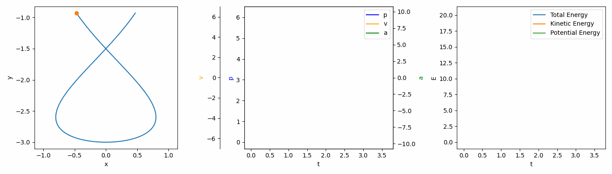

# rolling_stone_sim
### AKA roller coaster simulator

A fruit of my desire to learn some numeric simulations. Heavy use of [sympy](https://github.com/sympy/sympy) - who knows, maybe that's kind of a new thing to do (not that I checked). See [main.ipynb](main.ipynb) for how to use, or just try it out in [binder](https://mybinder.org/v2/gh/kre-ka/rolling_stone_sim/main?labpath=main.ipynb) (however animation is not really that smooth there).

## What can I do with it?
- simulate a particle mass in gravity field traversing numerous parametric curves (which means ***it can do loops***)
- watch it move in *almost* real time (or slower/faster if you want to)
- try and evaluate different numeric ODE (Ordinary Differential Equation) solvers - well, the ones that [scipy](https://github.com/scipy/scipy) provides
- define your own curve using [sympy](https://github.com/sympy/sympy) expressions
- model a curve using interactive plot (Bézier curves and splines coming some day (hopefully))
## TODO
A lot (there will be a real list, I promise)